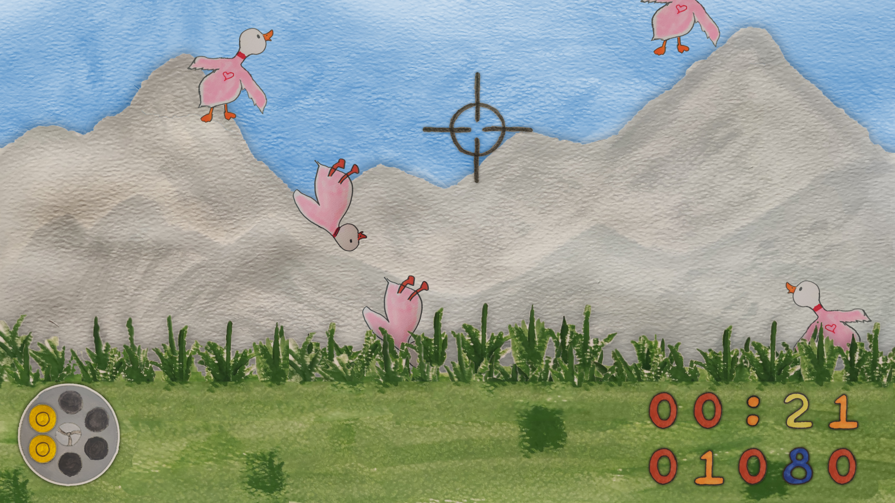

&nbsp;
&nbsp;

# Quack Hunt

Quack Hunt is a fun concept for a "Duck Hunt"-like game that uses image detection so that you can use your "finger guns" to shoot at ducks. This repository represents our submission for the [Microsoft PyGames Hackathon](https://pygames.devpost.com).

## Inspiration

The game Duck Hunt was released all the way back in 1984 for the Nintendo Entertainment System (NES). A somewhat unusual feature of this game was that it used a light gun as the main input device that allows you to point the gun at the screen and shoot objects. The gun basically contains a front-facing light sensor. When the trigger is hit, the game temporarily blacks out the screen and then shows bright white rectangles in place of the actual sprites. If the gun is aimed at a bright spot, a hit would be detected.

Our idea for this hackathon was to create a game like Duck Hunt but instead of using a light gun, why not simply use your fingers? We have come up with a Python-based image recognition system using OpenCV that is integrated into our game, tracks your hand motion, and detects when you attempt to "fire the gun".
