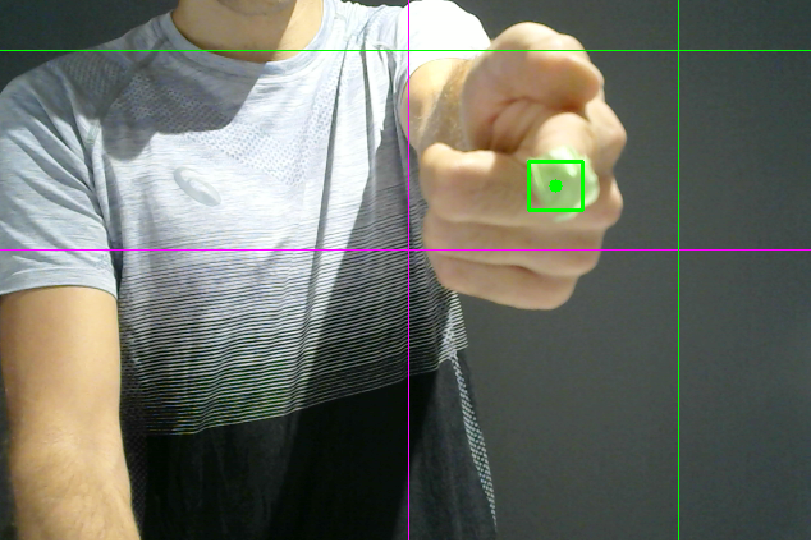
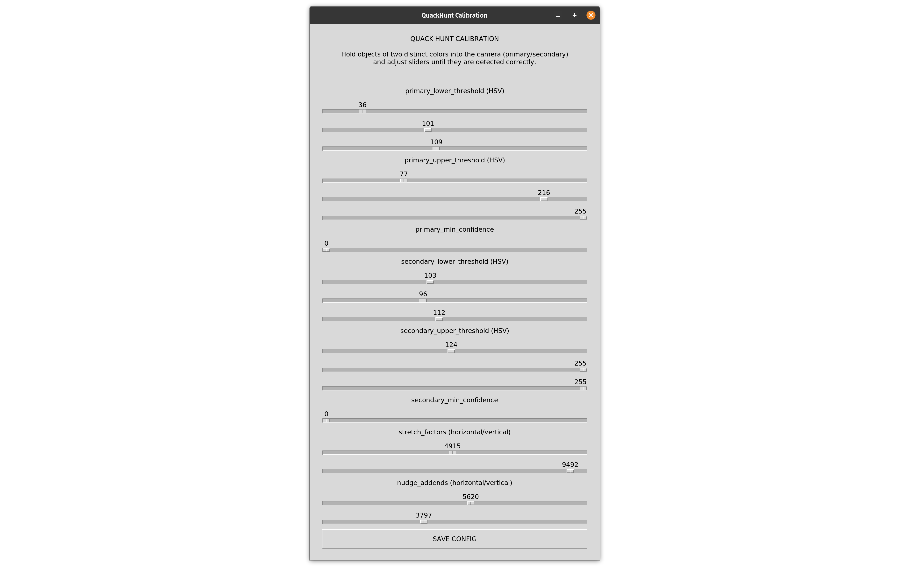

[](https://quackhunt.silentbyte.com)&nbsp;
[](https://quackhunt.silentbyte.com)&nbsp;
[](https://quackhunt.silentbyte.com)


# Quack Hunt

Quack Hunt is a fun concept for a "Duck Hunt"-like game that uses image detection so that you can use your "finger guns" to shoot at ducks. This repository represents our submission for the [Microsoft PyGames Hackathon](https://pygames.devpost.com).

Checkout the repository, run `pip install -r requirements.txt` followed by `python main.py` to start the game. You will need a webcam. :-)

[Click here to watch the submission video.](https://www.youtube.com/watch?v=Mw9rxFpf1tg)


## Inspiration

The game Duck Hunt was released all the way back in 1984 for the Nintendo Entertainment System (NES). A somewhat unusual feature of this game was that it used a light gun as the main input device that allows you to point the gun at the screen and shoot objects. The gun basically contains a front-facing light sensor. When the trigger is hit, the game temporarily blacks out the screen and then shows bright white rectangles in place of the actual sprites. If the gun is aimed at a bright spot, a hit would be detected.

Our idea for this hackathon was to create a game like Duck Hunt but instead of using a light gun, why not simply use your fingers? We have come up with a Python-based image recognition system using OpenCV that is integrated into our game, tracks your hand motion, and detects when you attempt to "fire the gun".


## What it does

The system consists of the following three parts:

1) The game itself is similar to Duck Hunt. The player targets objects such as ducks, hot air balloons, etc. Hitting the objects awards points. The goal is to reach a high score within a limited amount of time.

2) A second component is capturing video from an attached webcam and detecting the position of the player's hand in real-time. Through motion tracking, it is possible to determine where the player is pointing at on the screen. Moving the "finger gun" moves the on-screen crosshair accordingly and simulating firing the "finger gun" will fire the gun in the game.

3) To increase the reliability of the image recognition, we have also implemented a separate configuration tool (more information below).


## How we built it

### The Game

The game written in the Python programming language and uses [PyGame](https://www.pygame.org/) as the graphics back-end and for sound and input. Because PyGame is mainly intended as a thin wrapper around SDL, we have built our own little "game engine" on top of PyGame that allows us to create nodes that can be attached to our custom Scene Graph. With this system, it is much easier to add new objects with unique behaviors to the game without having to keep track of their position, logic, and rendering directly.

Here is an example:

```python
class CrosshairNode(SpriteNode):
    def __init__(self):
        super().__init__(
            name='crosshair',
            filename='./assets/gfx/crosshair.png',
            position=RENDER_ORIGIN,
        )

    def update(self, game: 'QuackHunt') -> None:
        target_position = game.aim_position

        for e in game.native_events:
            if e.type == pyg.MOUSEMOTION:
                target_position = Vec2(e.pos)
                game.aim_position = target_position
                break

        self.position = lerp_vec2(self.position, target_position, 15 * game.dt)

    def draw(self, surface: pyg.Surface, offset: Vec2) -> None:
        # Implement custom drawing behavior if desired.
        pass 
```

This node represents the on-screen crosshair. It moves itself automatically as soon as the aim position changes. Note that we do not have to render the sprite explicitly, this is all taken care of by the Scene Graph. Additionally, each node can have an arbitrary number of children that inherit the parent's position. This allows us to specify positions in "local space" instead of in "world space", greatly simplifying our logic.

When setting up the game objects, the following code is all that is required to initialize all nodes:

```python
self.scene_graph.add_child(
    SkyNode(),
    BackgroundNode(),
    GameLogicNode(),
    ForegroundNode(),
    HitNode(),
    UINode(),

    # The node defined above is added here. No more logic is required to display
    # a crosshair that follows the aim position.
    CrosshairNode(),
)
```

There are a number of other nodes available to deal with everything required for the game, such as `SpriteNode`, `SoundNode`, `TextNode`, etc.

Run `python main.py` to start the game.


### "Finger Gun" Detection and Motion Tracking

We are using [OpenCV](https://opencv.org) to fetch images from an attached webcam on one thread and analyze it on another thread in real-time by tracking two markers with the help of color filters and detection algorithms.

The detection is essentially split into two parts: a) detection and tracking of the finger position, and b) detection of when the "finger gun" is fired (rapid upward motion). Through a large number of variables (that can all be calibrated), we are transforming the detected position into screen coordinates that match where the player is pointing at on the screen, which dramatically improves the gameplay. The final coordinates are then read by the game, which moves the crosshair accordingly. Once the player "fires the finger gun", the game will be notified and behaves accordingly.

The following screenshot showcases the detection. The green square indicates where the "finger gun" has been detected. The pink line and the green line are used for calibration and indicate the origin position and the aim position at which the player is currently pointing (from the player's perspective in relation the physical monitor).




### The Calibration Tool

The detection process is reporting the aim position accurately. However, it depends on several variables that need to be calibrated correctly. In order to facilitate this, we have implemented a calibration dialog based on [Tkinter](https://docs.python.org/3/library/tkinter.html).



To aid with detection, two markers of distinct colors should be attached to the hand: one at the tip of the finger and one at the bottom of the hand.

| Variable                  | Meaning                                                                                                  |
|---------------------------|----------------------------------------------------------------------------------------------------------|
| primary_lower_threshold   | The lower threshold of the primary marker color (tip), specified as HSV                                  |
| primary_upper_threshold   | The upper threshold of the primary marker color (tip), specified as HSV                                  |
| primary_min_confidence    | Used to reject detections of the primary marker that are small and likely incorrect, reducing errors.    |
| secondary_lower_threshold | The lower threshold of the secondary marker color (bottom), specified as HSV                             |
| secondary_upper_threshold | The upper threshold of the secondary marker color (bottom), specified as HSV                             |
| secondary_min_confidence  | Used to reject detection of the seocndary marker that are likely incorrect, reducing errors.             |
| stretch_factors           | Specifies by how much the detected aim position (X/Y) should be magnified to match the physical monitor. |
| nudge_addends             | Specifies by how much the detected aim position (X/Y) should be offset to match the physical monitor.    |

Run `python main.py --calibrate` to start the calibration process and follow these steps.

1) Adjust primary and secondary thresholds until detection is correct and reliable. Only the two markers should be detected, no other objects or the background.
2) Position yourself centered in front of your webcam.
3) Point at the center of the physical monitor (the real-world screen, not what the webcam shows). 
4) Adjust the nudge addends so that green cross is matching up with the pink cross. 
5) Point at the top edge of the physical monitor and adjust the vertical stretch factor so that the horizontal green line touches the top edge of the virtual screen. 
6) Point at the right edge of the physical monitor and adjust the horizontal stretch factor so that the vertical green line touches the right edge of the virtual screen.

If done correctly, the green cross should now match exactly where you are pointing at on the physical monitor.


## Challenges we ran into

Getting the image recognition and motion tracking to work reliably was probably the most difficult aspect of this submission. Image recognition can be very finicky: initially, incorrect objects would be detected such as other parts of the body or the background. Also, even if the aim position is detected correctly, it cannot be translated into screen coordinates 1:1 without making any adjustments. This is also the main reason we created the calibration dialog with which all values can be adjusted in real-time, leading to much higher accuracy than fiddling with the raw numbers.  

Another minor challenge we ran into was that PyGame is relatively low-level. We addressed this pretty early on by creating our own "game engine" on top with a simple Scene Graph that made everything a little more convenient.


## Accomplishments that we're proud of

We are happy that we were able to make our initial idea manifest in a playable game. Also, we are happy with the hand-drawn art style we went with as we believe that it gives the game a unique touch. Everything worked out in the end. :-)


## What we learned

As this was our first time we even considered Python for game development, it was a nice opportunity to dive into PyGame and use it to implement our idea. We were also able to gain more insight into OpenCV and real-time image recognition and motion tracking. It was fun!


## What's next for Quack Hunt

Here is a list of our ideas:

- Add more hittable objects to the game, including other types of ducks with distinct behaviors and entities in the background that occasionally pop up.
- Add different types of stages and environments: target shooting, clay pigeon shooting, forest environment, etc.
- Add more types of guns that require different hand motions to use.
- Add more/better animations, particle effects, etc.
